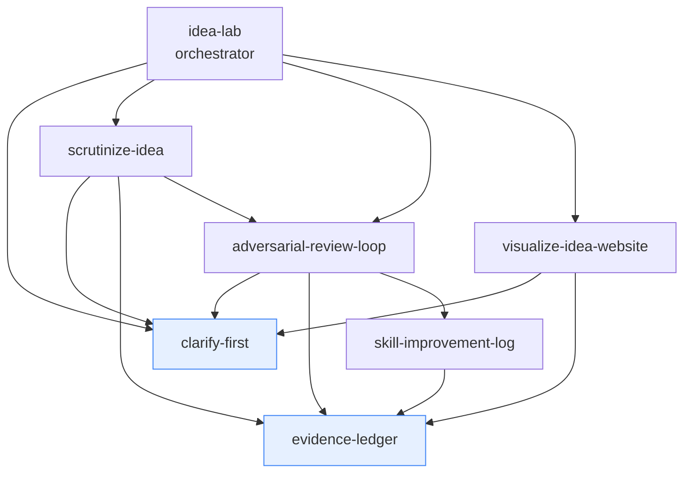

# Idea Lab (`idea-lab`)

> [!WARNING]
> **Pre-requisites**:
> - [`clarify-first`](file:///Users/roy.a2yush/Develop/Personal/aayushlalroy/cursor-knowledge-book/assets/skills/clarify-first/README.md) (Leaf Skill — gathers audience, scope, and goals)
> - [`evidence-ledger`](file:///Users/roy.a2yush/Develop/Personal/aayushlalroy/cursor-knowledge-book/assets/skills/evidence-ledger/README.md) (Leaf Skill — maintains assumption ledger)
> - [`scrutinize-idea`](file:///Users/roy.a2yush/Develop/Personal/aayushlalroy/cursor-knowledge-book/assets/skills/scrutinize-idea/README.md) (Leaf Skill — Phase 2 single-pass red-teaming)
> - [`adversarial-review-loop`](file:///Users/roy.a2yush/Develop/Personal/aayushlalroy/cursor-knowledge-book/assets/skills/adversarial-review-loop/README.md) (Orchestrator — Phase 3 multi-round hardening)
> - [`visualize-idea-website`](file:///Users/roy.a2yush/Develop/Personal/aayushlalroy/cursor-knowledge-book/assets/skills/visualize-idea-website/README.md) (Leaf Skill — Phase 4 visual prototype generation)

---

## What This Skill Does
Orchestrates end-to-end idea processing through a 4-phase pipeline: (1) Clarify scope, (2) Scrutinize & Red-team, (3) Harden via Adversarial Review Loop, and (4) Build an Interactive Visual Website Prototype.

---

## When to Use

### Triggers & Scenarios
- **End-to-End Idea Incubator**: When asked `"process my idea"`, `"idea lab"`, `"take my idea from raw concept to prototype"`, or `"incubate this idea"`.

### When NOT to Use
- Do NOT use if you only want a single quick critique without building a site prototype.

---

## Examples

### 4-Phase Pipeline Progression
```
Phase 1: Clarify (clarify-first) -> Q1, Q2, Q3 resolved
Phase 2: Scrutinize (scrutinize-idea) -> Steel-man, Pre-mortem, ICE/RICE scoring
Phase 3: Harden (adversarial-review-loop) -> 3 rounds of fresh-eyes review
Phase 4: Prototype (visualize-idea-website) -> React + Vite interactive dashboard
```

---

## Axon Import Command

Assuming you are in the `assets/` directory:

```bash
axon add skill skills/idea-lab
```

---

# Idea Lab — Skill Suite Docs

A composable suite of small, single-responsibility skills for taking a raw idea and
making it **honest, refined, and visible**. Two primitives, one loop, two domain skills,
and one orchestrator. Each is reusable on its own and composes into the others.

## The skills

| Skill | Path | One-line purpose |
|-------|------|------------------|
| **clarify-first** | `~/.cursor/skills/clarify-first/` | Never assume — ask clarifying questions with Recommended + other + freeform options before acting. |
| **evidence-ledger** | `~/.cursor/skills/evidence-ledger/` | Tag every claim as `[Evidenced]` or `[Assumption NN%]` and keep a running assumption ledger. |
| **adversarial-review-loop** | `~/.cursor/skills/adversarial-review-loop/` | Worker/Reviewer/Manager loop with fresh reviewers each round + a blind-spot log, 3-4 rounds. |
| **skill-improvement-log** | `~/.cursor/skills/skill-improvement-log/` | Appends manager-found blind spots as proposals to a human-reviewed backlog — never auto-applies. |
| **scrutinize-idea** | `~/.cursor/skills/scrutinize-idea/` | Red-team/validate an idea (pre-mortem, RAT, ICE/RICE, etc.) → critique + risks + refined idea. |
| **visualize-idea-website** | `~/.cursor/skills/visualize-idea-website/` | Build a modular, diagram-heavy, minimal-text interactive site for the idea. |
| **idea-lab** | `~/.cursor/skills/idea-lab/` | Orchestrator: clarify → scrutinize → refine → visualize, delegating to the above. |

All skills use `disable-model-invocation: true` — invoke them by name.

## How to use

- **Just a sanity check on an idea?** Use `scrutinize-idea`.
- **Want to see/present an idea?** Use `visualize-idea-website` (ideally after scrutinizing).
- **Want the full treatment?** Use `idea-lab` — it runs the whole pipeline.
- **Need rigorous review of any artifact (not just ideas)?** Use `adversarial-review-loop`.
- **Want recurring review misses captured for later?** `skill-improvement-log` (the
  manager calls it automatically) appends proposals to a human-reviewed backlog.
- **Building your own workflow?** Reuse `clarify-first` and `evidence-ledger` as
  primitives anywhere.

### Modes (control cost vs rigor)
`idea-lab` picks a mode in Phase 0: **Lite** (skip loop, small ideas), **Standard**
(1-2 loop rounds), **Deep** (3-4 rounds + visualize). Each skill also has its own lite
mode to avoid over-engineering.

## When to use which

| Situation | Skill |
|-----------|-------|
| Request is ambiguous / under-specified | clarify-first |
| Claims/decisions where reliability matters | evidence-ledger |
| "Is this a good idea?" / "poke holes in this" | scrutinize-idea |
| "Visualize / make a website out of this" | visualize-idea-website |
| "Review this until it's solid" (any artifact) | adversarial-review-loop |
| "Log this blind spot / skill improvement" | skill-improvement-log |
| "Run my idea through the lab" (end-to-end) | idea-lab |

## Composition graph



`clarify-first` and `evidence-ledger` (blue) are the shared primitives everything builds
on. Arrows mean "uses / delegates to". `idea-lab` never duplicates content — it delegates.
`skill-improvement-log` is called by the review loop's Manager to persist blind spots as
human-reviewed improvement proposals (it never auto-edits skills).

## Shared conventions (so skills compose cleanly)

**Evidence/assumption tags** (from `evidence-ledger`):
```
[Evidenced: user said budget is ₹50k]
[Assumption 65%: solo trip since no companions mentioned; ↑ if user confirms, ↓ if group implied]
```

**Clarifying-question format** (from `clarify-first`):
```
Q1: Who is the primary audience?
- a) Investors (Recommended) — your framing emphasized funding
- b) End users / customers
- c) Internal team / yourself
- d) Write your own: ______________
```

**Assumption ledger** — a table (`# | assumption | strength | ↑/↓ | status`) carried as
shared state across phases and rendered visually in the website's Assumptions & Risks
module.

## Design shortcomings + mitigations

| Shortcoming | Mitigation baked in |
|-------------|--------------------|
| Review loop adds latency/cost | Mode tiers; lite skips the loop; 4-round cap + converge stop |
| Over-engineering small ideas | Lite mode default at low stakes; visualization is opt-in |
| Review fatigue / diminishing returns | Stop after 2 consecutive no-new-issue rounds |
| Fresh-reviewer context setup overhead | Pre-written prompts in `adversarial-review-loop/prompts/PROMPTS.md` |
| Pretty visuals can mask weak logic | Scrutinize gates visualize; ledger surfaced in the UI |
| Skill sprawl / drift | Shared tag + question formats; orchestrator delegates, never duplicates |
| Auto-improving skills causes silent drift | `skill-improvement-log` only appends proposals to a human-reviewed backlog; never self-applies |
